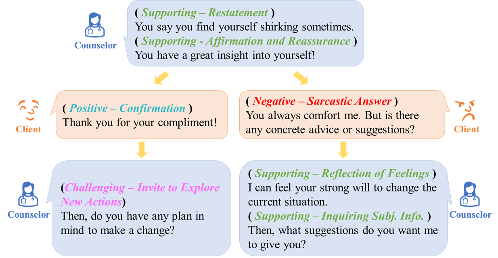
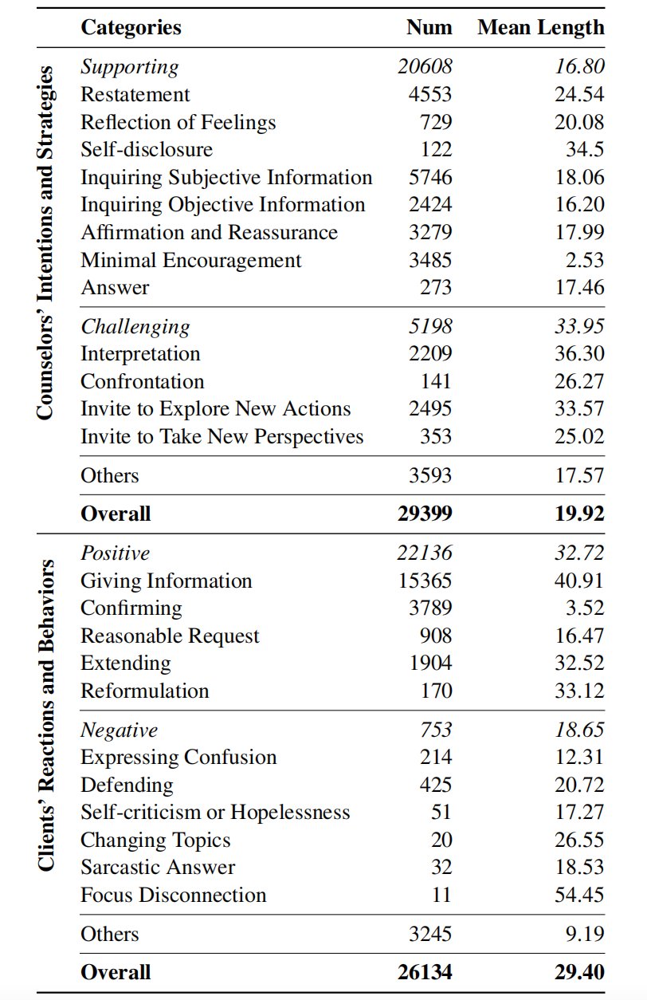

# Client-Reactions

This repository provides part of the code for Baseline Classifiers training and evaluation in our paper *Understanding Client Reactions in Online Mental Health Counseling*. (Our [paper]() has been accepted to ACL2023.)



## Dependencies
The code is implemented using python 3.8 and PyTorch v1.8.1

Anaconda / Miniconda is recommended to set up this codebase.

Please install dependencies through requirements.txt.
```bash
pip install -r requirements.txt
```

## Dataset
For certain reasons, we are currently unable to make our dataset publicly available. If you need access to our dataset, please contact Anqi(```lianqi@westlake.edu.cn```).


<!--  -->

## Training

- Domain Adaption(DA). We perform the masked language modeling (MLM) task on all the collected conversations. You can train your own DA model according to this [Transformers document](https://huggingface.co/docs/transformers/model_doc/bert#transformers.BertForMaskedLM). After Domain Adaption training, please place your model in the folder *pretrained_model*.

- Classifiers for Automatic Label Prediction. We provide a training script: run_dist.sh, please modify the SPEAKER and label_type in this file. Then train the classifier: 
    ```
    bash run.sh
    ```

## Test

We provide a test script: "mytest.sh". Once you have completed training, please specify the model_dir and label_type in the mytest.sh file, and then run ```bash mytest.sh``` for testing.

